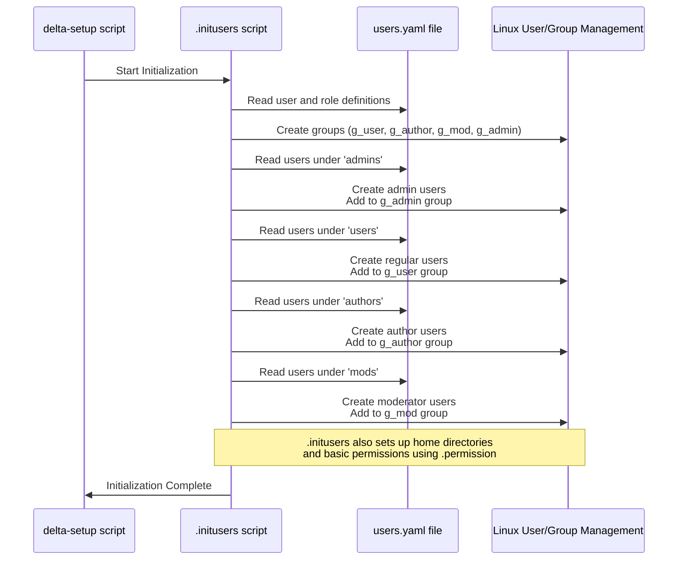

# Chapter 1: User Roles and Management

Welcome to the Delta-Blog-Setup project tutorial! In this first chapter, we'll start with a fundamental concept that organizes everything: **User Roles and Management**.

Imagine a bustling online blog platform. You have people who just read articles, people who write those articles, people who keep the platform clean and civil, and people who manage the whole show. Should everyone have the same abilities? Probably not! A regular reader shouldn't be able to delete someone else's blog post, and a writer might not need tools to moderate comments across the entire site.

This is where **User Roles** come in. Think of roles as different "hats" or levels of access that users can wear on our platform. Each hat gives you permission to do certain things and access specific parts of the system. It's like having different keys for different rooms in a building.

In our Delta Blog system, we define four main roles:

*   **Regular Users:** These are the readers. Their primary job is to read blogs and maybe interact in simple ways (like subscribing). They wear the `g_user` hat.
*   **Authors:** These users can write, edit, and publish their own blog posts. They are creators on the platform and wear the `g_author` hat.
*   **Moderators:** Moderators help keep the content appropriate. They might review blog posts or manage comments (though comment management isn't the main focus here). They wear the `g_mod` hat.
*   **Admins:** These users have the highest level of access. They can manage users, view reports, and pretty much do anything on the platform. They wear the `g_admin` hat.

You can see these roles mentioned in the project's main `ReadMe.md` file:

```markdown
## Roles and Permissions

- `g_user`: Regular users
- `g_author`: Users with blogging permissions
- `g_mod`: Moderators with filtering rights
- `g_admin`: Admins with complete access and report control
```

And the `Usage Guide for Runtime Scripts` table shows which roles are allowed to run certain scripts:

```markdown
## Usage Guide for Runtime Scripts

| Script           | Role      | Description                             | Usage Example                                     |
| ---------------- | --------- | --------------------------------------- | ------------------------------------------------- |
| suprise          | User      | Subscribe or unsubscribe from an author | `bash /scripts/suprise bala`                      |
| promote-req      | User      | Request for promotion                   | `sudo /scripts/promote-req`                       |
| blogfilter       | Moderator | Approve or block author blogs           | `bash /scripts/blogfilter bala`                   |
| userFY           | Admin     | View blog and user statistics           | `bash /scripts/userFY username`                   |
| approvepromotion | Admin     | Approve or deny promotion requests      | `sudo /scripts/approvepromotion username approve` |
| manageblogs      | Author    | Create, edit, and publish blogs         | `bash /scripts/manageblogs -super blog1`          |
```

Notice how scripts like `manageblogs` can only be used by `Author`, `blogfilter` by `Moderator`, and `approvepromotion` / `userFY` by `Admin`. This is the power of roles!

### How are Users and Roles Managed Initially?

The project uses standard Linux users and groups to represent these roles. The names `g_user`, `g_author`, `g_mod`, and `g_admin` correspond directly to Linux group names. When you set up the system, users are created on your Linux system and assigned to these groups based on a configuration file.

That configuration file is `users.yaml`. Let's look at a simplified piece of it:

```yaml
# File: scripts/users.yaml (Simplified Snippet)
admins:
- name: Mukund Krishnan
  username: mukundk

users:
- name: Aarav
  username: aarav01

authors:
- name: Ananya
  username: ananya

mods:
- name: Praveen
  username: praveen
  authors:
  - ananya
  - bala
```

This YAML file lists users under their respective role categories (`admins`, `users`, `authors`, `mods`). This is the blueprint for setting up users and their initial roles.

When you run the main setup script `sudo bash delta-setup`, it calls a crucial background script called `.initusers`. This script reads `users.yaml` and performs the necessary system commands to create users, create the role-based groups, and add each user to their primary role group.

### What Happens During Setup? (Under the Hood)

Let's trace what happens when `delta-setup` runs `.initusers`:



The `.initusers` script essentially automates standard Linux user administration tasks based on the `users.yaml` configuration. It uses commands you might be familiar with if you've managed users on Linux, like `groupadd` to create groups and `useradd` or `usermod` to create users and assign them to groups.

While we don't have the exact `.initusers` source in the provided snippets, we can see from `deleteusers` how it would likely read the `users.yaml` structure. The `deleteusers` script loops through sections like `users`, `authors`, etc., confirming that `.initusers` would do something similar but for creation:

```bash
# From scripts/deleteusers (Simplified snippet showing how users.yaml is read)

USERS_FILE="/scripts/users.yaml"

remove_users() {
  section=$1 # 'users', 'authors', 'mods', or 'admins'
  # ... other setup ...

  i=0
  while true; do
    # Reads each entry in the section array
    entry=$(yq ".$section[$i]" "$USERS_FILE")
    [ "$entry" == "null" ] && break # Stop when no more entries

    # Extracts the username from the entry
    username=$(echo "$entry" | yq ".username")
    
    # In .initusers, this would be useradd/usermod
    # For deleteusers, it's userdel
    userdel -r "$username" 2>/dev/null 
    echo "Removed user: $username"

    i=$((i+1))
  done

  # ... groupdel for the section ...
}

# Calls remove_users for each section
remove_users users
remove_users authors
# ... etc ...
```

This snippet from `deleteusers` shows how the script iterates through the lists under `users`, `authors`, `mods`, and `admins` in the `users.yaml` file, extracts the `username`, and then performs a system action (`userdel` in this case, but `useradd`/`usermod` for `.initusers`).

So, the initial user and role setup is handled automatically when you run `sudo bash delta-setup`, based on the definitions in `users.yaml`.

### In Summary

User Roles are the first layer of organization in the Delta Blog system. They categorize users into different types (User, Author, Moderator, Admin) and determine their fundamental capabilities. This is implemented using standard Linux users and groups, configured via the `users.yaml` file and set up automatically by the `.initusers` script during the main project setup.

But simply having a role isn't enough to *guarantee* security or control *exactly* what files or directories a user can access. That's where permissions come in.

In the next chapter, we will dive into **[Permissions and Access Control (ACLs)](02_permissions_and_access_control__acls__.md)** to understand how the system enforces what actions users with different roles can actually perform on files and directories.

[Next Chapter: Permissions and Access Control (ACLs)](02_permissions_and_access_control__acls__.md)

---

