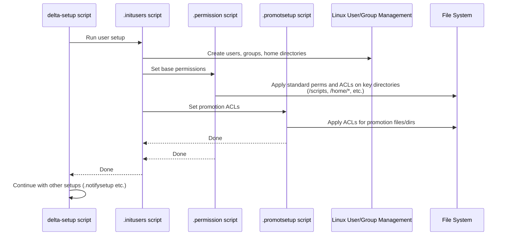

# Chapter 2: Permissions and Access Control (ACLs)

Welcome back to the Delta-Blog-Setup tutorial! In [Chapter 1: User Roles and Management](01_user_roles_and_management_.md), we learned how users are assigned different roles (like User, Author, Moderator, Admin) using Linux groups. This tells us *what kind* of things a user is generally allowed to do.

But simply knowing a user is an `Author` isn't enough. How do we make sure:

*   An Author can *only* write blog posts in their *own* dedicated space?
*   A regular `User` can *only* read published blogs, not drafts or private files?
*   A `Moderator` can access specific files needed for moderation, but not sensitive admin reports?
*   An `Admin` can access report files that others cannot?

This is where **Permissions and Access Control (ACLs)** come in. Think of user roles as giving someone a certain level of clearance in a building (e.g., "Employee," "Manager," "Security"). Permissions and ACLs are like the specific keys and access cards that let that person open *particular* doors and access *specific* rooms within their clearance level.

They control *who* can do *what* to *which* files and directories in the system.

### Traditional Linux Permissions: The Basics

You might already know about basic Linux permissions, which use `rwx` (read, write, execute) for three categories:

*   **Owner:** Permissions for the user who owns the file/directory.
*   **Group:** Permissions for users who are in the file's group.
*   **Others:** Permissions for everyone else on the system.

When you list files with `ls -l`, you see something like this:

```bash
ls -l /home/authors/ananya
# Expected output might look like this (details can vary):
# drwxr-xr-x 3 ananya ananya 4096 Oct 26 10:30 blogs
# drwxr-xr-x 2 ananya ananya 4096 Oct 26 10:30 public
# drwxr-xr-x 2 ananya ananya 4096 Oct 26 10:30 subscribers_only
# -rw-rw-r-- 1 ananya ananya  123 Oct 26 10:31 blogs.yaml
```

Let's break down `drwxr-xr-x` for the `blogs` directory:

*   `d`: Means it's a directory.
*   `rwx`: The **owner** (`ananya`) has read, write, and execute permissions.
*   `r-x`: The **group** (`ananya` group) has read and execute (needed to enter/list directory) permissions, but *no* write.
*   `r-x`: **Others** (everyone else) have read and execute permissions, but *no* write.

This works for basic cases, but what if you need a specific *group* (`g_user`) to have read access to a file owned by `ananya` (owner `ananya`, group `ananya`), but you *don't* want `others` to have access? Or what if you need multiple different groups to have different permissions on the same file? Traditional permissions get complicated quickly.

### Access Control Lists (ACLs): More Control

This is where **Access Control Lists (ACLs)** shine. ACLs let you add extra permission rules beyond the standard owner, group, and others. You can specify permissions for:

*   Specific **users**, even if they aren't the owner.
*   Specific **groups**, even if they aren't the primary group of the file.

In the Delta Blog system, ACLs are used extensively to implement the fine-grained access needed for different user roles on specific content and directories.

The main commands for ACLs are:

*   `getfacl <file/directory>`: Shows the ACLs set on a file or directory.
*   `setfacl <options> <file/directory>`: Sets or modifies ACLs.

### Use Case: Publishing a Blog and Allowing Users to Read It

Let's revisit the example from the description: How does an Author publish a blog so regular Users can read it?

1.  **Author writes blog:** An author, say `ananya`, writes a blog post. She uses the `manageblogs` script. This script creates or updates a file inside her private blog directory, for example: `/home/authors/ananya/blogs/my-first-blog.txt`.
2.  **Initial Permissions:** By default, this file is likely owned by `ananya:ananya` and might have standard permissions like `-rw-rw-r--`. Only `ananya` can write to it.
3.  **Author Publishes:** When `ananya` decides to *publish* the blog using `manageblogs -p my-first-blog.txt`, the script does a few things:
    *   It might link the file into a "public" directory like `/home/authors/ananya/public/`.
    *   Crucially, it uses `setfacl` to grant the `g_user` group read permission on the *original* blog file (`/home/authors/ananya/blogs/my-first-blog.txt`).

Let's look at the relevant part of the `manageblogs` script:

```bash
# From scripts/manageblogs (Simplified snippet)

function publish() {
    # ... other publishing logic ...
    ln -sf "$blogpath" "/home/authors/$author/public/$blogname" # Link the file to the public directory

    # This is where the ACL is set!
    setfacl -m "g:g_user:r" "$blogpath" 2>/dev/null || echo "setfacl failed" 

    echo "Blog '$blogname' published to public."
}
```

The important line is `setfacl -m "g:g_user:r" "$blogpath"`. Let's break down this command:

*   `setfacl`: The command to set ACLs.
*   `-m`: Option to *modify* the existing ACLs (or add a new one).
*   `"g:g_user:r"`: This is the ACL entry being added:
    *   `g`: Specifies this rule applies to a *group*.
    *   `g_user`: The name of the group the rule applies to (our regular user role group!).
    *   `r`: The permission being granted – `r` for read.
*   `"$blogpath"`: The file the rule applies to (e.g., `/home/authors/ananya/blogs/my-first-blog.txt`).

After this command runs successfully, let's see what `getfacl` shows on that blog file:

```bash
# Assuming 'ananya' published 'my-first-blog.txt'
getfacl /home/authors/ananya/blogs/my-first-blog.txt

# Expected output might look something like this:
# # file: /home/authors/ananya/blogs/my-first-blog.txt
# # owner: ananya
# # group: ananya
# user::rw-          # ananya (owner) has read/write
# group::rw-         # ananya group has read/write (standard group permission)
# other::r--         # Others have read (standard others permission)
# group:g_user:r--   # <-- NEW! The g_user group has read access via ACL
```

Now, any user who is a member of the `g_user` group can read the file `/home/authors/ananya/blogs/my-first-blog.txt`, even though they aren't the owner and the standard group/other permissions might not have allowed it. They can access it via the link in the public directory.

This is a core example of how ACLs provide the necessary flexibility beyond basic Linux permissions to implement the project's security requirements.

### Where Permissions and ACLs Are Set

The project sets up permissions and ACLs in a few key places during the initial `sudo bash delta-setup` run:

1.  **Base Permissions:** The `.initusers` script, after creating users and directories, calls `.permission`. This `.permission` script is responsible for setting the fundamental permissions and ACLs on critical directories and scripts, ensuring only the right roles can access things like `/scripts`, `/scripts/reports`, `/home/users`, `/home/authors`, etc.
2.  **Promotion ACLs:** The `.promotsetup` script, also called by `delta-setup`, specifically sets up ACLs needed for the promotion mechanism. For instance, it might give admins permission to write to the promotion request file.
3.  **Runtime ACLs:** Scripts like `manageblogs` use `setfacl` on the fly (as shown above) when an action requires changing who can access a specific file (like making a blog readable by users).

Let's visualize the setup process involving permissions:



The `.permission` script is where the majority of initial permission rules are defined. While we don't have the full code, its purpose, as described in `/scripts/ReadMe.md`, is clear: "Sets up group and file-level permissions". It would contain commands like `chmod` and `setfacl` targeting directories like `/scripts/reports`, `/home/authors`, etc., granting specific roles (`g_admin`, `g_author`, etc.) appropriate read/write/execute permissions.

Similarly, `.promotsetup` (as described in `/scripts/ReadMe.md`: "Sets ACLs required for promotion") would likely contain `setfacl` commands to allow admins access to the promotion request file (`/scripts/requests.yaml`, mentioned in `approvepromotion`).

Let's look at the `approvepromotion` script again, specifically how it moves an author's directory and sets permissions on the *new* author directories:

```bash
# From scripts/approvepromotion (Simplified snippet)

if [[ "$decision" == "approve" ]]; then
    # ... change user group/home ...
    mv "/home/users/$username" "/home/authors/$username" # Move user's home

    dirs="/home/authors/$username/blogs /home/authors/$username/public /home/authors/$username/subscribers_only"
    mkdir -p $dirs # Create required subdirectories

    chown -R "$username:$username" "/home/authors/$username" # Set ownership
    
    # Set standard permissions on the new author directories
    chmod u=rwx,g=rwx,o=x $dirs 
    
    # Set standard permissions on the blogs.yaml file
    chmod u=rw,g=rw,o= "/home/authors/$username/blogs.yaml" 
    
    # Give 'others' execute permission on the public directory (needed to traverse it)
    chmod o+rx "/home/authors/$username/public" 

    # ... create symlinks for users ...
    echo "User '$username' promoted to author."
else
# ... handle reject ...
fi
```

While this snippet uses `chmod` (standard permissions) and `chown` (change owner), the `.permission` script, which runs earlier during setup, is where the *initial* complex ACLs are likely defined for system-wide directories and potentially default permissions for new user/author directories before specific files are created. The `approvepromotion` script ensures the *new* author directories have basic correct permissions after the move and creation. The `manageblogs` script then adds file-specific ACLs (like giving `g_user` read access) when a blog is published.

Together, standard Linux permissions and ACLs create a robust system where user roles are enforced at the file system level, controlling precisely what each user can access and modify.

### In Summary

Permissions and Access Control (ACLs) are the file-level security layer of the Delta Blog system. They work alongside User Roles by specifying *which* files and directories users with certain roles can interact with, and *how* (read, write, execute).

*   Basic Linux `rwx` permissions cover the owner, group, and others.
*   ACLs provide more granular control, allowing specific permissions for arbitrary users or groups.
*   The `setfacl` command is used to apply these specific rules, as seen when `manageblogs` makes a blog readable by the `g_user` group.
*   Initial permissions and ACLs for key directories and files are set during system setup by scripts like `.permission` and `.promotsetup`.

Understanding this layer is crucial to seeing how the system protects content and ensures users can only perform actions appropriate for their role on the designated files and directories.

Now that we understand who can do what and where, let's move on to how Authors actually manage their content within these permission boundaries.

[Next Chapter: Blog Content Management](03_blog_content_management_.md)

---

