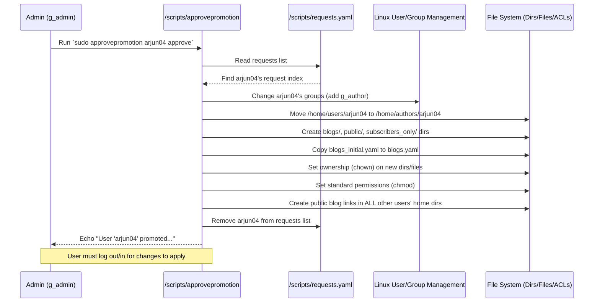

# Chapter 6: Author Promotion Workflow

Welcome back to the Delta-Blog-Setup tutorial! In [Chapter 5: Notification System](05_notification_system_.md), we saw how users get notified about exciting new content from authors they follow. But what if a user isn't just a reader? What if they have their own stories, ideas, or expertise they want to share? How does a regular user become an author in the Delta Blog system?

This is where the **Author Promotion Workflow** comes in!

Think of it like applying for a special writing job on the platform. It's not something just anyone can do instantly. A regular user needs to formally *ask* for this new role, and someone with higher authority (an administrator) needs to review and approve that request. Only then does the system give the user the tools and access needed to write and publish blogs.

The problem this workflow solves is: **How to manage the transition of a regular user (`g_user`) into an author (`g_author`) in a controlled and secure way.**

Here's the basic process:

1.  A user decides they want to be an author and makes a **request**.
2.  This request is **recorded** somewhere the administrators can see.
3.  An **administrator** looks at the list of requests.
4.  The administrator decides to either **approve** or **reject** the request.
5.  If **approved**, the system makes several changes to the user's account and workspace to give them the author role and permissions.

Let's see how this works step-by-step in the Delta Blog system.

### Step 1: A User Requests Promotion

Suppose a user named `arjun04` has been reading blogs and now feels inspired to write their own. As a regular user (`g_user`), they don't currently have the ability to run the `manageblogs` script or access the author directories.

To request promotion, `arjun04` uses the `/scripts/promote-req` script. According to the [Usage Guide in /scripts/ReadMe.md](scripts/ReadMe.md), this script is available to `User`s:

```markdown
| Script           | Role      | Description                             | Usage Example                                     |
| ---------------- | --------- | --------------------------------------- | ------------------------------------------------- |
| promote-req      | User      | Request for promotion                   | `sudo /scripts/promote-req`                       |
```

Notice the `sudo` in the usage example. This is important! The `promote-req` script needs to write to a file that is not typically writable by regular users (only administrators), specifically the `/scripts/requests.yaml` file. Running it with `sudo` gives it the temporary permission to modify this system file.

So, `arjun04` logs into their account and runs:

```bash
# Assuming logged in as arjun04
sudo /scripts/promote-req
```

If this is their first time requesting, the script will add their name to the pending requests list.

```
Promotion request submitted.
```

If they try to run it again before their request is processed, the script checks if their name is already on the list:

```bash
# Assuming logged in as arjun04, request already pending
sudo /scripts/promote-req
```

Output:

```
Promotion request already exists. Please wait for admin approval.
```

#### What Happens Under the Hood? (`promote-req`)

The `promote-req` script is quite simple. It gets the username of the person who ran `sudo` (that's what `$SUDO_USER` provides), checks if that user is already in the `requests.yaml` file, and if not, it adds their username to the `requests` list within that YAML file.

Here's a look at the relevant part of `/scripts/promote-req`:

```bash
# From scripts/promote-req (Simplified)

REQUESTS_FILE="/scripts/requests.yaml"
username="$SUDO_USER" # Get the username of the user who ran sudo

# Export username so yq can read it
export username

# Check if the username already exists in the 'requests' list using yq
exists=$(yq e '.requests[] == env(username)' "$REQUESTS_FILE")

# If yq found 'true' (meaning the user exists in the list)
if echo "$exists" | grep -q true; then
    echo "Promotion request already exists. Please wait for admin approval."
else
    # If user not found, add their username to the 'requests' list
    yq -i '.requests += [env(username)]' "$REQUESTS_FILE"
    echo "Promotion request submitted."
fi
```

The key line is `yq -i '.requests += [env(username)]' "$REQUESTS_FILE"`.
*   `yq -i`: Use `yq` to edit the file in place.
*   `.requests += [env(username)]`: This `yq` expression selects the `requests` list (`.requests`) and appends (`+=`) a new item to it. The item is a list containing the `username` obtained from the environment variable `env(username)`.

So, after `arjun04` runs the script, the `/scripts/requests.yaml` file, which starts empty like this:

```yaml
# File: /scripts/requests.yaml (Initially)
requests: []
```

will look like this:

```yaml
# File: /scripts/requests.yaml (After arjun04's request)
requests:
  - arjun04
```

If another user, say `userC`, also requests promotion, the file would become:

```yaml
# File: /scripts/requests.yaml (After userC's request)
requests:
  - arjun04
  - userC
```

The `/scripts/requests.yaml` file simply serves as a queue or a list of usernames waiting for an admin's decision.

### Step 2: The Request is Pending

At this point, `arjun04`'s request is recorded in `/scripts/requests.yaml`. It's now waiting for an administrator to see it and take action.

There isn't a specific script provided just for admins to "list pending requests", but an administrator could easily view the contents of `/scripts/requests.yaml` manually:

```bash
# Assuming logged in as an admin user
cat /scripts/requests.yaml
```

Or using `yq` to get just the list of usernames:

```bash
# Assuming logged in as an admin user
yq e '.requests[]' /scripts/requests.yaml
```

Output:

```
arjun04
userC
```

This shows the admin who is waiting for promotion.

### Step 3: The Admin Reviews and Acts

Once an administrator sees the pending requests, they can decide to approve or reject each one. The script they use for this is `/scripts/approvepromotion`.

This script is only available to `Admin` users (`g_admin`), as listed in the [Usage Guide](scripts/ReadMe.md):

```markdown
| Script           | Role      | Description                             | Usage Example                                     |
| ---------------- | --------- | --------------------------------------- | ------------------------------------------------- |
| approvepromotion | Admin     | Approve or deny promotion requests      | `sudo /scripts/approvepromotion username approve` |
```

Again, this script modifies system settings (user groups, home directories, permissions), so it requires `sudo`.

An administrator logs in and runs the script, providing the username of the requester and their decision (`approve` or `reject`).

For example, if an admin wants to approve `arjun04`:

```bash
# Assuming logged in as an admin user
sudo /scripts/approvepromotion arjun04 approve
```

If they decide to reject `userC`:

```bash
# Assuming logged in as an admin user
sudo /scripts/approvepromotion userC reject
```

### Step 4: System Changes (Approval) or Removal (Rejection)

The `/scripts/approvepromotion` script handles both outcomes:

*   **If Rejected:** The script simply removes the username from the `requests` list in `/scripts/requests.yaml`.

    ```bash
    # From scripts/approvepromotion (Simplified rejection part)

    # Check if the user's request exists in the list
    req_index=$(yq e ".requests | index(\"$username\")" "$REQUESTS_FILE")
    # ... (check if index is not null) ...

    if [[ "$decision" == "reject" ]]; then
        # Remove the user's entry from the requests list using yq
        yq -i "del(.requests[$req_index])" "$REQUESTS_FILE"
        echo "Request rejected."
        exit 0
    fi
    ```

    The `yq -i "del(.requests[$req_index])"` command finds the position (index) of the user's name in the `requests` list and deletes that item.

*   **If Approved:** This is where the significant changes happen. The script performs several actions to transform a regular user account into an author account. These actions require administrator privileges, which is why `sudo` is needed.

    Here's a simplified look at the approval steps within `/scripts/approvepromotion`:

    ```bash
    # From scripts/approvepromotion (Simplified approval part)

    if [[ "$decision" == "approve" ]]; then
        # 1. Change the user's primary group and add to g_author
        #    This is the core role change!
        usermod -g "$username" -G g_author "$username"
        echo "Changed group for user '$username'"

        # 2. Move the user's home directory
        #    From /home/users/username to /home/authors/username
        mv "/home/users/$username" "/home/authors/$username"
        echo "Moved home directory to /home/authors/$username"

        # 3. Define and create author-specific subdirectories
        dirs="/home/authors/$username/blogs /home/authors/$username/public /home/authors/$username/subscribers_only"
        mkdir -p $dirs # Create blogs/, public/, subscribers_only/
        echo "Created author subdirectories"

        # 4. Copy the template blogs.yaml file
        cp "$BLOGS_INITIAL_FILE" "/home/authors/$username/blogs.yaml"
        echo "Copied blogs.yaml template"

        # 5. Set ownership (user is now the owner)
        chown -R "$username:$username" "/home/authors/$username"
        echo "Set ownership"

        # 6. Set basic permissions on directories and blogs.yaml
        #    u=rwx,g=rwx,o=x on dirs (owner/group full, others traverse)
        chmod u=rwx,g=rwx,o=x $dirs
        #    u=rw,g=rw,o= on blogs.yaml (owner/group read/write, others none)
        chmod u=rw,g=rw,o= "/home/authors/$username/blogs.yaml"
        #    Ensure others can traverse public directory (for symlinks)
        chmod o+rx "/home/authors/$username/public"
        echo "Set permissions"

        # 7. Create symlinks for *other* regular users
        #    This lets them easily browse ALL authors' public blogs via /home/users/their_name/all_blogs/this_author_name
        for path in /home/users/*/all_blogs; do
            # link this new author's public dir into every user's all_blogs dir
            ln -sfn "/home/authors/$username/public" "$path/$username"
            echo "Created public blog link in user home directories: $path/$username"
        done

        # 8. Remove the request from requests.yaml (using the same yq command as rejection)
        yq -i "del(.requests[$req_index])" "$REQUESTS_FILE"
        echo "Request processed and removed from list."

        echo "User '$username' promoted to author successfully."
    else
        echo "$HELP_TEXT"
        exit 1
    fi
    ```

Let's break down the key Linux commands used during approval:

*   `usermod -g "$username" -G g_author "$username"`: This modifies the user account (`usermod`). `-g "$username"` sets their primary group to a group with the same name as their username (a common convention). `-G g_author` adds them to the `g_author` supplementary group. Now, the user is primarily in their personal group but *also* a member of the `g_author` group, giving them the role-based permissions.
*   `mv "/home/users/$username" "/home/authors/$username"`: This physically moves the user's home directory from the `/home/users/` area to the `/home/authors/` area.
*   `mkdir -p $dirs`: Creates the necessary subdirectories (`blogs`, `public`, `subscribers_only`) inside the user's new author home directory. `-p` ensures parent directories are created if needed (though `/home/authors/$username` exists from the `mv`).
*   `cp "$BLOGS_INITIAL_FILE" "/home/authors/$username/blogs.yaml"`: Copies a template `blogs.yaml` file (likely containing basic category structure) into the author's home directory.
*   `chown -R "$username:$username" "/home/authors/$username"`: Changes the **owner** and **group owner** of the user's new home directory and everything inside it (`-R` for recursively) to the user's own username. This makes them the primary owner of their workspace.
*   `chmod ...`: Sets the standard read/write/execute permissions on the directories and the `blogs.yaml` file. This is the basic layer of permission before ACLs.
*   `ln -sfn ...`: Creates symbolic links for *other* users to access the *new* author's public content. The `for` loop ensures this link is added in every *other* user's `all_blogs` directory. This means a user logged in as `userB` can find `arjun04`'s public blogs by navigating to `/home/users/userB/all_blogs/arjun04/`.

After all these steps, `arjun04` is now a full-fledged `g_author`! Their account is set up, their workspace is created, and initial permissions are in place.

**Important Note:** The system notes in the `ReadMe.md` explicitly state: "After promotion or demotion, the user must log out and log back in for changes to take effect." This is because Linux group memberships and home directory changes are typically applied at login.

#### Under the Hood (Approval Workflow Diagram)

Let's visualize the approval part of the workflow:



This diagram shows how one command from the admin triggers a cascade of system-level changes managed by the `approvepromotion` script.

#### Initial Promotion Setup (`.promotsetup`)

How does the `approvepromotion` script itself have permission to modify `/scripts/requests.yaml`? And who ensures the `/home/authors` directory exists initially? This setup is handled by the `.promotsetup` script during the main `delta-setup` run.

As mentioned in the [/scripts/ReadMe.md](scripts/ReadMe.md):

```markdown
| Script       | Purpose                                        |
| ------------ | ---------------------------------------------- |
| .promotsetup | Sets ACLs required for promotion mechanism     |
```

And the main `delta-setup` script calls it:

```bash
sudo bash delta-setup
# ...
# Runs .promotsetup
# ...
```

The `.promotsetup` script would contain commands (likely using `setfacl` from [Chapter 2](02_permissions_and_access_control__acls__.md)) to give the `g_admin` group the necessary write permissions on the `/scripts/requests.yaml` file and potentially ensure the base `/home/authors` directory has appropriate permissions for the `approvepromotion` script to create subdirectories within it later.

### In Summary

The Author Promotion Workflow is a structured process for a user to transition from a regular reader to an author.

1.  A user initiates the process by running `sudo /scripts/promote-req`, which adds their username to the `/scripts/requests.yaml` file.
2.  An administrator reviews the `/scripts/requests.yaml` file (manually or using `yq`).
3.  The administrator uses `sudo /scripts/approvepromotion <username> <approve|reject>` to act on the request.
4.  If approved, the `approvepromotion` script performs several key system changes: updates the user's groups (`g_author`), moves their home directory to `/home/authors/`, creates the necessary author subdirectories, copies the template `blogs.yaml`, sets ownership and basic permissions, and creates symlinks for other users to access the new author's public content.
5.  The user must log out and log back in for their new author role and permissions to take effect.

This workflow ensures that only approved users gain the ability to publish content, maintaining control and structure within the blog platform.

Now that we understand how users become authors and manage their content, let's look at some additional features related to user preferences and general information.

[Next Chapter: User Preferences and FYI](07_user_preferences_and_fyi_.md)

---

<sub><sup>Generated by [AI Codebase Knowledge Builder](https://github.com/The-Pocket/Tutorial-Codebase-Knowledge).</sup></sub> <sub><sup>**References**: [[1]](https://github.com/JACKURUVI99/Delta-Blog-Setup/blob/2ca0ab6329198dc437d264c5b624e7ba1f90f76a/ReadMe.md), [[2]](https://github.com/JACKURUVI99/Delta-Blog-Setup/blob/2ca0ab6329198dc437d264c5b624e7ba1f90f76a/scripts/ReadMe.md), [[3]](https://github.com/JACKURUVI99/Delta-Blog-Setup/blob/2ca0ab6329198dc437d264c5b624e7ba1f90f76a/scripts/approvepromotion), [[4]](https://github.com/JACKURUVI99/Delta-Blog-Setup/blob/2ca0ab6329198dc437d264c5b624e7ba1f90f76a/scripts/pending_promotions.txt), [[5]](https://github.com/JACKURUVI99/Delta-Blog-Setup/blob/2ca0ab6329198dc437d264c5b624e7ba1f90f76a/scripts/promote-req), [[6]](https://github.com/JACKURUVI99/Delta-Blog-Setup/blob/2ca0ab6329198dc437d264c5b624e7ba1f90f76a/scripts/requests.yaml)</sup></sub>