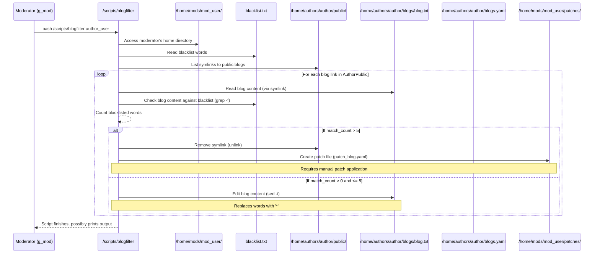

# Chapter 8: Content Moderation

Welcome back! We've learned about user roles, permissions, how authors manage content, subscriptions, notifications, and even how users become authors. Now, let's talk about a critical part of running any shared platform: keeping the content appropriate and safe. This is where **Content Moderation** comes in!

Imagine our blog platform grows popular. Authors are publishing all sorts of interesting things! But sometimes, someone might accidentally (or intentionally) include inappropriate language, harmful content, or spam in their posts. We need a way to catch this before it's widely seen by readers.

The problem Content Moderation solves is: **How do we review blog content and automatically flag or remove things that don't meet the platform's standards?**

In our Delta Blog system, this is handled by a dedicated script that acts like a digital editor, checking blog posts for specific words that are considered forbidden. Depending on how many forbidden words are found, the system takes action, either cleaning up the blog post or removing it from public view entirely.

The core idea is straightforward:

1.  Moderators have a list of forbidden words (a **blacklist**).
2.  A Moderator runs a special **script** to check an author's blogs.
3.  The script compares the blog content against the blacklist.
4.  Based on the results, the script automatically **redacts** (stars out) some words or **archives** the entire blog.

Let's look at the main tool for this: the `blogfilter` script.

### The `blogfilter` Script: The Moderator's Tool

The system provides a specific script for users with the `g_mod` (Moderator) role: `/scripts/blogfilter`.

According to the [Usage Guide in /scripts/ReadMe.md](../scripts/ReadMe.md), this script is for Moderators:

```markdown
| Script           | Role      | Description                             | Usage Example                                     |
| ---------------- | --------- | --------------------------------------- | ------------------------------------------------- |
| blogfilter       | Moderator | Approve or block author blogs           | `bash /scripts/blogfilter bala`                   |
```

The description says "Approve or block", but based on the script's code, its function is more about **detecting and reacting to blacklisted words** rather than a manual approval workflow. It automatically applies redaction or archiving rules based on the blacklist count.

To use it, a Moderator logs in to their account and runs the script, providing the `username` of the author whose blogs they want to check.

### Where is the Blacklist Stored?

Each Moderator has their *own* personal blacklist file. This file is stored in their home directory: `/home/mods/username/blacklist.txt`.

This allows different moderators to potentially have slightly different lists if needed, though in a real system, a shared list might be more common.

The `blacklist.txt` file is a simple text file, with one forbidden word per line.

Example of `/home/mods/praveen/blacklist.txt`:

```
# File: /home/mods/praveen/blacklist.txt
badword1
anotherforbiddenphrase
termx
```

When a Moderator runs the `blogfilter` script for the first time, if their `blacklist.txt` file doesn't exist, the script will create it for them.

### How to Moderate an Author's Blogs (Step-by-Step)

Let's imagine a Moderator named `praveen` wants to check the public blogs written by the author `ananya`.

1.  **Log in as the Moderator:** Make sure you are logged in as the `g_mod` account (e.g., `praveen`).
2.  **Run the `blogfilter` Script:** Execute the script, providing the author's username as an argument.

    ```bash
    # Assuming you are logged in as praveen
    bash /scripts/blogfilter ananya
    ```

3.  **Script Runs Checks:** The script will now do its work:
    *   It finds `ananya`'s public blogs (located via symlinks in `/home/authors/ananya/public/`).
    *   It reads `praveen`'s `/home/mods/praveen/blacklist.txt`.
    *   It checks each public blog file linked in `ananya`'s public directory.

4.  **Script Takes Action (Automatically):** The script automatically decides what to do for *each* blog file based on how many blacklisted words it finds:
    *   **If 1 to 5 blacklisted words are found:** The script will edit the blog file(s) and replace the blacklisted words with asterisks (`*`). This is **Redaction**.
    *   **If more than 5 blacklisted words are found:** The script will **Archive** the blog. It removes the public link to the blog and creates a special "patch" file suggesting the blog's status should be updated in `blogs.yaml`.

The script might output messages like:

```
Found blacklisted word badword1 in my-first-article.txt at line 5
Found blacklisted word termx in my-first-article.txt at line 10
Blog travel-adventure.txt is archived due to excessive blacklisted words
Patch file created: /home/mods/praveen/patches/patch_travel-adventure.yaml (Apply manually to /home/authors/ananya/blogs.yaml)
```

### What Happens Under the Hood? (`blogfilter`)

Let's look at how the `/scripts/blogfilter` script performs these checks and actions.

First, the script needs the author's username and information about the moderator and paths:

```bash
#!/bin/bash

author="$1" # Author's username passed as argument
mod_user="$(whoami)" # Moderator running the script
home="/home/authors/$author" # Author's main directory
public_dir="$home/public" # Author's public blog directory (symlinks)
blogs_file="$home/blogs.yaml" # Author's blog metadata file
mod_home="/home/mods/$mod_user" # Moderator's home directory
blacklist_file="$mod_home/blacklist.txt" # Moderator's blacklist
patch_dir="$mod_home/patches" # Directory for patch files

# Check if author username was provided
if [[ -z "$author" ]]; then
    echo "Usage: $0 <author_username>"
    exit 1
fi

# Ensure moderator's blacklist exists (creates it if not)
if [[ ! -f "$blacklist_file" ]]; then
    mkdir -p "$mod_home"
    touch "$blacklist_file"
    chown "$mod_user:$mod_user" "$blacklist_file" # Ensure moderator owns it
    chmod 700 "$blacklist_file" # Only owner can read/write/execute (execute for directory)
    echo "Blacklist file created at $blacklist_file"
    exit 1
fi

# Check if the author has any public blogs to filter
if [[ ! -d "$public_dir" ]]; then
    echo "Author $author has no public blogs."
    exit 1
fi

# Create directory for patch files if it doesn't exist
mkdir -p "$patch_dir"

# Now, loop through each file linked in the author's public directory
# This is where the main filtering logic happens for each blog
for blog_path in "$public_dir"/*; do
    [[ -f "$blog_path" ]] || continue # Skip if not a regular file (e.g., broken symlink)
    blogname=$(basename "$blog_path") # Get the simple filename (e.g., my-first-article.txt)
    # Get the path to the *original* blog file in the author's blogs/ directory
    blog_full="$home/blogs/$blogname"
    match_count=0 # Reset match count for each blog

    # --- Blacklist Checking ---
    # Use grep to find lines containing words from the blacklist
    # -i: ignore case
    # -n: show line numbers
    # -I: ignore binary files (though blogs are text, good practice)
    # -f "$blacklist_file": read patterns from the blacklist file
    # "$blog_path": search in the blog file (actually the symlink to the original)
    # 2>/dev/null: suppress errors if grep fails
    # <(...) : Process the output of grep line by line
    while IFS= read -r match; do
        lineno=$(echo "$match" | cut -d: -f1) # Extract line number from grep output (e.g., 5:This has badword1)
        line=$(echo "$match" | cut -d: -f2-) # Extract the line content
        # Now, for each matching LINE, check each blacklisted WORD in that line
        # -o: print only the matched word
        # -i: ignore case
        # -f "$blacklist_file": match words from the blacklist file
        # <<< "$line": read the line content as input
        for word in $(grep -o -i -f "$blacklist_file" <<< "$line"); do
            echo "Found blacklisted word $word in $blogname at line $lineno"
            match_count=$((match_count + 1)) # Increment counter
        done
    done < <(grep -in -I -f "$blacklist_file" "$blog_path" 2>/dev/null)

    # --- Action Based on Match Count ---

    if [[ "$match_count" -gt 5 ]]; then
        # --- Archive Action (More than 5 matches) ---
        echo "Blog $blogname is archived due to excessive blacklisted words ($match_count)."

        # Remove the public link (makes it inaccessible to readers)
        unlink "$blog_path" 2>/dev/null

        # Create a patch file to update blogs.yaml
        patch_file="$patch_dir/patch_${blogname%.txt}.yaml"
        cat > "$patch_file" <<EOF # Write YAML content to the patch file
blogs:
  - file_name: "$blogname"
    publish_status: false # Set status to false
    mod_comment: "Found $match_count blacklisted words" # Add a comment
EOF
        # The patch file is generated, but *must be applied manually* by an admin/moderator
        echo "Patch file created: $patch_file (Apply manually to $blogs_file)"
        continue # Move to the next blog
    fi

    if [[ "$match_count" -gt 0 ]]; then
        # --- Redaction Action (1 to 5 matches) ---
        echo "Redacting blacklisted words in $blogname ($match_count matches)."

        # Redact words in *both* the public symlink and the original file
        # Looping through both paths ensures consistency, though editing the original is key
        for f in "$blog_path" "$blog_full"; do
            [[ -f "$f" ]] || continue # Ensure the file exists

            # Create a temporary script for sed commands
            tmp_sed=$(mktemp)
            # Loop through each word in the blacklist
            while IFS= read -r word; do
                word=$(echo "$word" | xargs)  # trim whitespace
                [[ -z "$word" ]] && continue # Skip empty lines

                # Escape special characters in the word for sed
                escaped=$(printf '%s\n' "$word" | sed -e 's/[][\/.^$*+?|(){}]/\\&/g')
                # Create a string of asterisks the same length as the word
                stars=$(printf "%${#word}s" | tr ' ' '*')

                # Add a sed command to the temporary script:
                # s/pattern/replacement/Ig
                # s: substitute
                # $escaped: the word to find (escaped for safety)
                # $stars: the asterisks to replace with
                # I: case-insensitive match
                # g: replace all occurrences on the line
                echo "s/$escaped/$stars/Ig" >> "$tmp_sed"
            done < "$blacklist_file" # Read the blacklist file into this loop

            # Apply the sed script to the current file ($f) in place (-i)
            sed -i -f "$tmp_sed" "$f"
            # Remove the temporary sed script
            rm -f "$tmp_sed"
        done # End of loop for public and full blog paths
    fi
    # If match_count is 0, do nothing for this blog.
done # End of loop through public blogs

```

This script snippet reveals the key steps:

1.  It sets up paths and checks for required files/directories.
2.  It loops through the public blog links found in the author's `public/` directory.
3.  For each blog, it uses `grep -f` to find lines containing any blacklisted word from the moderator's `blacklist.txt`.
4.  It then parses the `grep` output to count the total number of *individual blacklisted words* found across all matching lines in that blog.
5.  Based on the `match_count`:
    *   If `> 5`, it `unlink`s the public symlink (removing public access) and writes a YAML "patch" file to the moderator's `patches` directory. This patch file contains the suggested change for the author's `blogs.yaml` (setting `publish_status` to `false`) but the comment clearly states it needs to be applied *manually*.
    *   If `> 0` and `<= 5`, it enters the redaction logic, using `sed -i -f` to edit both the public symlink file and the original file. It builds a temporary `sed` script from the blacklist, replacing each blacklisted word (case-insensitively) with asterisks of the same length.

#### Moderation Workflow Diagram

Let's visualize the process when a Moderator runs the script:



This diagram shows the `blogfilter` script orchestrating the process of checking blogs against the blacklist and taking the appropriate action (archiving or redacting) based on the count.

### Permissions and Moderation

How does the Moderator's script have permission to read author blog files and potentially modify them or remove symlinks?

*   **Reading Blogs:** Public blogs are accessible via symlinks in `/home/authors/authorname/public/`. As we saw in [Chapter 2: Permissions and Access Control (ACLs)](02_permissions_and_access_control__acls__.md), Authors use `setfacl` to give the `g_user` group read permission on the original blog files when publishing. Since Moderators (`g_mod`) might also be in the `g_user` group, or more likely, the initial system setup (`.permission` script) grants the `g_mod` group explicit read access to author directories or public content areas, the `blogfilter` script (run as a moderator) can read these files.
*   **Modifying Files/Links:** The `blogfilter` script runs with the permissions of the moderator user (`praveen` in our example). The script needs write permission to:
    *   The blog files themselves (for redaction). This is tricky if the author owns the file. Perhaps the `.permission` script grants `g_mod` group write access via ACLs on author blog directories, or the script relies on shared group write permissions. Looking at the `manageblogs` script snippet for publishing, the original file is owned by the author. The `blogfilter` script running as the moderator would need permissions to modify this file. The most likely scenario in a well-configured system is that the `.permission` script, run during initial setup, uses `setfacl` to give the `g_mod` group read and write permissions on the author's `/home/authors/author/blogs/` directory specifically for moderation purposes.
    *   The public symlink (`/home/authors/author/public/blog.txt`). The directory `/home/authors/author/public/` is owned by the author, but the `.permission` script likely sets group or ACL permissions allowing `g_mod` to delete entries within it.
    *   The moderator's own `blacklist.txt` and `patches/` directory: The script ensures the moderator user owns these and has full permissions (using `chown` and `chmod` when creating `blacklist.txt`).

The `.permission` script run during `delta-setup` is crucial for setting up the necessary file and directory permissions (potentially using ACLs) to allow Moderators to perform their duties.

### In Summary

Content Moderation in the Delta Blog system is an automated process triggered by Moderators.

*   Moderators use the `/scripts/blogfilter` script to check an author's public blogs.
*   The script compares blog content against the Moderator's personal `/home/mods/username/blacklist.txt`.
*   Based on the count of blacklisted words found:
    *   Few matches (1-5) result in the script automatically **redacting** the words in the blog file(s), replacing them with asterisks.
    *   Too many matches (> 5) result in the script **archiving** the blog by removing its public link and creating a patch file for manual update of the author's `blogs.yaml`.
*   The `.permission` script run during system setup is responsible for granting Moderators the necessary file system permissions (read/write) on author directories to perform these actions.

This mechanism acts as an automated filter to help maintain appropriate content standards on the platform.

Now that we've covered moderation, let's move on to the final core concept: how Administrators can view reports and analytics about the blog's activity.

[Next Chapter: Admin Reporting System](09_admin_reporting_system_.md)

---

<sub><sup>Generated by [AI Codebase Knowledge Builder](https://github.com/The-Pocket/Tutorial-Codebase-Knowledge).</sup></sub> <sub><sup>**References**: [[1]](https://github.com/JACKURUVI99/Delta-Blog-Setup/blob/2ca0ab6329198dc437d264c5b624e7ba1f90f76a/ReadMe.md), [[2]](https://github.com/JACKURUVI99/Delta-Blog-Setup/blob/2ca0ab6329198dc437d264c5b624e7ba1f90f76a/scripts/ReadMe.md), [[3]](https://github.com/JACKURUVI99/Delta-Blog-Setup/blob/2ca0ab6329198dc437d264c5b624e7ba1f90f76a/scripts/blogfilter)</sup></sub>