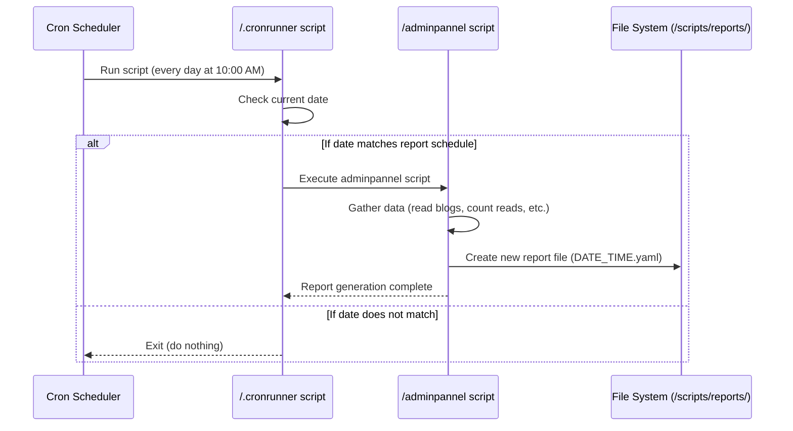

# Chapter 9: Admin Reporting System

Welcome to the final chapter of our Delta-Blog-Setup tutorial! We've explored how users read and subscribe, how authors create content and get promoted, and how moderators keep things clean. Now, let's look at the bigger picture: **Admin Reporting System**.

Imagine you are the administrator of this blog platform. You want to know how things are going! Which blogs are popular? Who are the most read authors? How many blogs are published? This kind of information helps you understand the platform's activity and make decisions.

The problem the Admin Reporting System solves is: **How can administrators get automatic summaries and statistics about the platform's content and user activity?**

Think of it like getting a regular business report. Instead of manually counting blogs and trying to track reads, the system does it for you!

Here's the core idea:

1.  A special script runs on a schedule (like once a week or month).
2.  This script gathers data from various parts of the system (like author blogs and read counts).
3.  It compiles all this data into a structured report file.
4.  Administrators can then view this report file to see the statistics.

This chapter will explain how this automatic reporting works, showing you the scripts involved and where the reports end up.

### The Report Itself: A YAML File

The output of the reporting system is a simple file containing the collected statistics. In the Delta Blog system, these reports are generated in **YAML format** and saved in a dedicated directory: `/scripts/reports/`.

Each report file will have a name based on the date and time it was generated, like `2023-10-26_14-30-00.yaml`.

As an administrator (`g_admin`), your primary interaction with the reporting system is **viewing these report files**.

You can list the reports:

```bash
# Assuming logged in as an admin user
ls /scripts/reports/
```

Expected output:

```
2023-10-26_14-30-00.yaml
2023-11-02_10-00-00.yaml
...
```

And you can view the content of a specific report using `cat` or `yq`:

```bash
# Assuming logged in as an admin user, viewing the latest report
cat /scripts/reports/2023-11-02_10-00-00.yaml
```

The report structure is similar to the example shown in the `ReadMe.md`:

```yaml
# Example Admin Report Output (/scripts/reports/DATE_TIME.yaml)
blogs:
  - file_name: "travelblog"
    author: "bala"
    categories: ["Travel", "Lifestyle"]
    reads: 12

categories:
  Travel: 2
  Lifestyle: 1

top_articles:
  - file_name: "travelblog"
    reads: 12

total_published: 5
total_deleted: 1
```

This YAML structure provides key statistics:
*   A list of individual `blogs` with their author, categories, and `reads` count.
*   A `categories` section showing how many blogs are in each category.
*   `top_articles` highlighting the most read blogs.
*   `total_published` and `total_deleted` counts.

Reading these reports gives an administrator a snapshot of the platform's health and activity.

### Under the Hood: Automation is Key

Admins don't have to remember to run a script every week. The reporting is **automated** using the system's cron scheduler. Two scripts are involved:

1.  `.cronrunner`: This script is scheduled by cron and checks if it's the right *day* to run the main report generator.
2.  `adminpannel`: This is the main script that actually *gathers* the data and *generates* the report file. `.cronrunner` triggers this script.

Let's look at the `ReadMe.md` to see how this is scheduled:

```markdown
## Sample Crontab Entries

```cron
@reboot /scripts/.notifyserver
*/1 * * * * /scripts/.notifycorn
0 10 * * * /scripts/.cronrunner
```

## Reporting System Flow

- `.cronrunner` is scheduled using crontab
- It validates if current day is:
  - Thursday
  - First or last Saturday of Feb, May, Aug, Nov
- If valid, it triggers `adminpannel`
- Report is saved at `/scripts/reports/DATE_TIME.yaml`
```

The crontab entry `0 10 * * * /scripts/.cronrunner` means the `.cronrunner` script will run automatically at 10:00 AM (`0 10`) every day (`* * *`).

The `.cronrunner` script then checks the current date. It's programmed to *only* proceed and run `adminpannel` if the date matches specific criteria:
*   Any Thursday, OR
*   The first Saturday of February, May, August, or November, OR
*   The last Saturday of February, May, August, or November.

If the date *doesn't* match these specific days, `.cronrunner` simply exits without doing anything. If the date *does* match, `.cronrunner` executes the `adminpannel` script.



This ensures that reports are generated automatically on a predefined schedule without manual intervention.

### The Report Generator: `adminpannel`

The heavy lifting of collecting the data is done by the `/scripts/adminpannel` script. As noted in the `ReadMe.md` and the script itself, this script is only intended for **Admins** (`g_admin`).

```bash
# From scripts/adminpannel (Simplified start)
#!/bin/bash

# Check if the user running this script is an admin
if ! groups "$(whoami)" | grep -qw "g_admin"; then
  echo "Only admins can run this script."
  exit 1
fi

# ... date checking logic (if run manually, this would make it exit unless on a report day) ...

REPORT_DIR="/scripts/reports"
mkdir -p "$REPORT_DIR" # Ensure the reports directory exists
timestamp=$(date "+%Y-%m-%d_%H-%M-%S") # Get current date and time
REPORT_OUTPUT="$REPORT_DIR/$timestamp.yaml" # Define the output file path

# Initialize the report file with basic structure
cat <<EOF > "$REPORT_OUTPUT"
blogs: []
categories: {}
top_articles: []
total_published: 0
total_deleted: 0
EOF

# ... rest of the script collects data and populates the YAML structure ...
```

This snippet shows that the script first confirms the user is an admin. It then sets up the reports directory and creates a new, empty report file with the necessary top-level YAML keys (`blogs`, `categories`, etc.). The rest of the script's job is to fill in this structure with actual data.

How does it collect the data? It needs to look at all authors and their blogs.

```bash
# From scripts/adminpannel (Simplified data collection loop)

# Find all author directories
authors=($(ls -1p /home/authors | grep '/$' | sed 's#/##'))

# Loop through each author
for author in "${authors[@]}"; do
  blogs_yaml="/home/authors/$author/blogs.yaml" # Path to author's metadata file
  [[ -f "$blogs_yaml" ]] || continue # Skip if blogs.yaml doesn't exist

  # Use yq to get the number of blogs listed in the author's blogs.yaml
  blog_count=$(yq '.blogs | length' "$blogs_yaml")

  # Loop through each blog entry in the author's blogs.yaml
  for ((i = 0; i < blog_count; i++)); do
    file_name=$(yq ".blogs[$i].file_name" "$blogs_yaml") # Get blog filename
    status=$(yq ".blogs[$i].publish_status" "$blogs_yaml") # Get publish status
    cat_order=($(yq ".blogs[$i].cat_order[]" "$blogs_yaml")) # Get category numbers

    # Path to the blog file *in the public directory* (for checking reads)
    blog_path="/home/authors/$author/public/$file_name"

    # --- Count Reads ---
    read_count=0
    # Loop through potential user read log files
    for log_file in /home/users/*/blog_reads.log; do
      [[ -f "$log_file" ]] || continue # Skip if log file doesn't exist
      # Count lines in the log file that contain the path to this specific blog
      count=$(grep -c "$blog_path" "$log_file" || true)
      ((read_count += count)) # Add count from this log file to total for this blog
    done

    # --- Tally Categories ---
    cat_names=() # Array to store category names for this blog
    for index in "${cat_order[@]}"; do
      # Look up the category name using the number from author's blogs.yaml
      cname=$(yq ".categories[$index]" "$blogs_yaml")
      [[ "$cname" == "null" || -z "$cname" ]] && cname="Uncategorized" # Handle missing category
      cat_names+=("$cname") # Add name to list for this blog

      # Count this category for the overall report tally
      # (Logic uses a temporary file or yq commands to increment category counts)
      # ... yq logic to update category count in a temporary structure ...
    done

    # --- Build Blog Entry for Report ---
    # Format the collected data into a YAML entry for this blog
    # ... yq or text formatting to create blog YAML snippet ...

    # Append the blog entry to the 'blogs' list in the main report file
    # ... yq logic to append entry to $REPORT_OUTPUT ...
  done
done

# --- Final Calculations and Structure ---
# ... Calculate top articles, total published/deleted by processing the collected blog data ...
# ... Add category tally and totals to the report file ...

echo "Report generated: $REPORT_OUTPUT"
```

This simplified walk-through shows the core logic:
1.  Iterate through every author's home directory.
2.  Read their `blogs.yaml` file ([Chapter 3]) to get details about *all* their blogs (published or not).
3.  For each blog, look up its potential path in the public directory (`/home/authors/author/public/`).
4.  **Crucially:** It then searches through every user's potential `blog_reads.log` file in `/home/users/*/` and counts how many times the path to the blog appears. This is how it gets the `reads` count. (Note: The mechanism for how `blog_reads.log` files are populated isn't explicitly detailed in the provided snippets, but `adminpannel` relies on them being there with blog paths recorded).
5.  It also tallies the categories used by each blog to build the overall `categories` count for the report.
6.  Finally, it uses `yq` to structure all this collected data and save it into the specific timestamped report file in the `/scripts/reports/` directory.

The script also calculates totals and finds top articles based on the read counts before finishing the report.

### Initial Setup and Permissions (`.permission`)

During the initial `sudo bash delta-setup`, the `.permission` script is run (as covered in [Chapter 2: Permissions and Access Control (ACLs)](02_permissions_and_access_control__acls__.md)). This script ensures that the `/scripts/reports/` directory exists and that users in the `g_admin` group have the necessary permissions (read and write) to create and read files in this directory. This is why the `adminpannel` script, running as an admin, can successfully write the report file there.

```bash
# From scripts/.permission (Conceptual snippet)

# Ensure reports directory exists and is owned by root/root
mkdir -p /scripts/reports
chown root:root /scripts/reports

# Give group g_admin read and write access to the reports directory
# Use standard permissions or potentially ACLs
chmod g+rw /scripts/reports
# Potentially set default ACLs for files created in this directory
# setfacl -d -m g:g_admin:rw /scripts/reports
```

This ensures that only administrators can access the sensitive report data.

### In Summary

The Admin Reporting System provides administrators with valuable insights into the blog platform's activity.

*   A background script, `.cronrunner`, is scheduled by cron to run daily.
*   `.cronrunner` checks if the current date matches a predefined schedule (specific Thursdays and Saturdays in certain months).
*   If the date matches, `.cronrunner` triggers the main reporting script, `adminpannel`.
*   The `adminpannel` script (which only admins can run) scans author `blogs.yaml` files and user `blog_reads.log` files to collect statistics on published blogs, reads per blog, and category popularity.
*   It compiles this data into a structured YAML report file and saves it with a timestamp in the `/scripts/reports/` directory.
*   Administrators can view these report files using standard Linux tools like `cat` or `yq`.
*   The `.permission` script ensures the reports directory is secure and accessible only to administrators.

This automated process gives admins the information they need to monitor and manage the platform effectively, concluding our exploration of the core features of the Delta-Blog-Setup project.

---

<sub><sup>Generated by [AI Codebase Knowledge Builder](https://github.com/The-Pocket/Tutorial-Codebase-Knowledge).</sup></sub> <sub><sup>**References**: [[1]](https://github.com/JACKURUVI99/Delta-Blog-Setup/blob/2ca0ab6329198dc437d264c5b624e7ba1f90f76a/ReadMe.md), [[2]](https://github.com/JACKURUVI99/Delta-Blog-Setup/blob/2ca0ab6329198dc437d264c5b624e7ba1f90f76a/scripts/ReadMe.md), [[3]](https://github.com/JACKURUVI99/Delta-Blog-Setup/blob/2ca0ab6329198dc437d264c5b624e7ba1f90f76a/scripts/adminpannel)</sup></sub>