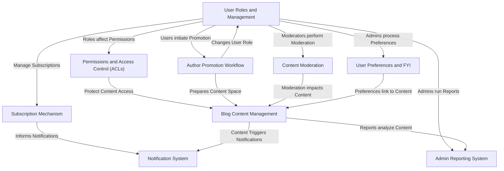

# Tutorial: Delta-Blog-Setup

This project sets up a **role-based blog platform** where different users (regular Users, Authors, Moderators, Admins) have distinct permissions controlled by **Access Control Lists (ACLs)**. Authors can **create and manage blog content**, which can be public or **subscriber-only**. Users can **subscribe** to authors to get **notifications** of new exclusive content. There's a workflow for users to request **author promotion**, **moderation** tools to filter content, and an **admin reporting system** for platform insights, alongside a basic **user preference** system for potential content recommendations.

## Visual Overview

## Chapters

1. [User Roles and Management
](01_user_roles_and_management_.md)
2. [Permissions and Access Control (ACLs)
](02_permissions_and_access_control__acls__.md)
3. [Blog Content Management
](03_blog_content_management_.md)
4. [Subscription Mechanism
](04_subscription_mechanism_.md)
5. [Notification System
](05_notification_system_.md)
6. [Author Promotion Workflow
](06_author_promotion_workflow_.md)
7. [User Preferences and FYI
](07_user_preferences_and_fyi_.md)
8. [Content Moderation
](08_content_moderation_.md)
9. [Admin Reporting System
](09_admin_reporting_system_.md)

---
