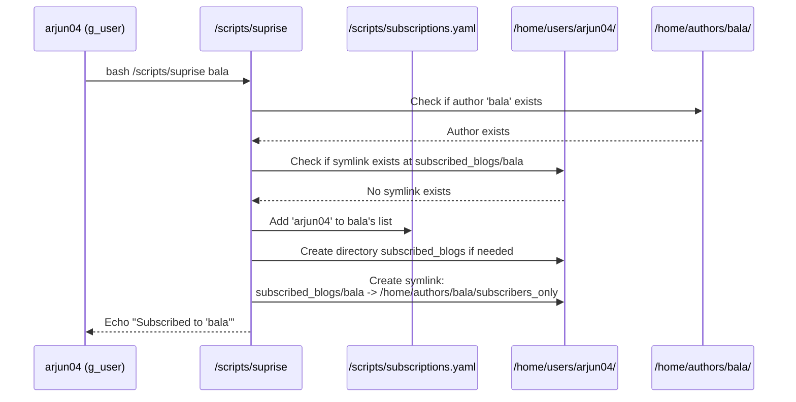

# Chapter 4: Subscription Mechanism

Welcome back to the Delta-Blog-Setup tutorial! In [Chapter 3: Blog Content Management](03_blog_content_management_.md), we learned how Authors create and publish their blog posts, deciding whether they are public or intended only for special subscribers.

But how do regular users actually *become* subscribers? And how do they easily find that special subscriber-only content? This is where the **Subscription Mechanism** comes in!

Think about your favorite online creators – maybe a YouTuber, a writer on a platform, or someone with a newsletter. If you really like their work, you often "subscribe" or "follow" them. This means you want to be notified when they release something new, especially exclusive content just for fans. Our Subscription Mechanism works just like that!

The problem this mechanism solves is simple: **Allowing users to easily follow authors they like and gain streamlined access to their subscriber-only content.**

The core idea is that a regular user (`g_user`) can create a special link or connection to an author. This connection is recorded, and it also creates a direct path for the user to access the author's exclusive content directory.

### The `suprise` Script: Your Subscription Tool

The Delta Blog system provides a specific script for users to manage their subscriptions: `/scripts/suprise`.

According to the [Usage Guide in /scripts/ReadMe.md](scripts/ReadMe.md), this script is for `g_user` (Regular Users) and is used to subscribe or unsubscribe from an author:

```markdown
| Script           | Role      | Description                             | Usage Example                                     |
| ---------------- | --------- | --------------------------------------- | ------------------------------------------------- |
| suprise          | User      | Subscribe or unsubscribe from an author | `bash /scripts/suprise bala`                      |
```

You run it simply by typing `bash /scripts/suprise` followed by the `username` of the author you want to subscribe to.

### How to Subscribe to an Author (Step-by-Step)

Let's imagine a regular user named `arjun04` wants to subscribe to an author named `bala`.

1.  **Log in as the User:** Make sure you are logged in as the `g_user` account (e.g., `arjun04`).

2.  **Run the `suprise` Script:** Execute the script, providing the author's username as an argument.

    ```bash
    # Assuming you are logged in as arjun04
    bash /scripts/suprise bala
    ```

3.  **Confirm Subscription:** If successful, the script will confirm your subscription.

    ```
    Subscribed to 'bala'
    ```

That's it! You are now subscribed to `bala`.

### How to Unsubscribe

If `arjun04` later decides they no longer want to follow `bala`, they simply run the *same* command again:

```bash
# Assuming you are logged in as arjun04
bash /scripts/suprise bala
```

The script is smart enough to detect that you are already subscribed and will instead unsubscribe you.

```
Unsubscribed from 'bala'
```

The `suprise` script acts as a toggle – running it once subscribes you, running it again unsubscribes you.

### What Happens When You Subscribe? (Under the Hood)

When you run `bash /scripts/suprise <authorname>`, the script does two main things behind the scenes:

1.  **It updates a central list:** Your username is added to a record that tracks which users are subscribed to which authors. This list is stored in a file called `/scripts/subscriptions.yaml`.
2.  **It creates a shortcut:** It creates a special link (a symbolic link, like a shortcut in Windows or an alias in macOS) in *your* home directory that points directly to the author's `subscribers_only` directory.

Let's look at the key components and how the script interacts with them.

#### The `subscriptions.yaml` File

This file is the central record of all subscriptions. It's a simple YAML file where each author is a key, and the value is a list of usernames who are subscribed to them.

Here's what `/scripts/subscriptions.yaml` might look like after `arjun04` subscribes to `bala`:

```yaml
# File: /scripts/subscriptions.yaml
bala:
  - arjun04
```

If another user, say `userB`, also subscribes to `bala`, the file would update to:

```yaml
# File: /scripts/subscriptions.yaml
bala:
  - arjun04
  - userB
```

The `suprise` script uses the `yq` tool (which you may remember from previous chapters is used for managing YAML data) to add or remove your username from the correct author's list in this file.

#### The Symlink Creation

The second, equally important step is creating a symbolic link in the user's home directory.

When `arjun04` subscribes to `bala`, the `suprise` script creates this link:

`/home/users/arjun04/subscribed_blogs/bala` pointing to `/home/authors/bala/subscribers_only`

Let's visualize the process of `arjun04` subscribing to `bala`:



This symlink `/home/users/arjun04/subscribed_blogs/bala` acts as a direct *doorway* for `arjun04`. Now, instead of needing to know the full path `/home/authors/bala/subscribers_only`, `arjun04` can simply navigate to `/home/users/arjun04/subscribed_blogs/bala` to view the contents of that directory.

#### How Access is Granted (Connecting to Chapter 2)

Remember [Chapter 2: Permissions and Access Control (ACLs)](02_permissions_and_access_control__acls__.md)? We learned that Authors use `setfacl` when publishing subscriber-only content (`manageblogs -super`) to give the `g_user` group read access to the original blog file in their `blogs/` directory.

The symlink created by the `suprise` script provides the *path* to the author's `subscribers_only` directory. Since the files *within* that directory (which are actually symlinks pointing back to the `blogs/` directory) have the correct ACLs for `g_user` to read them, the subscribing user can successfully access and read the content by following the path through their new `/home/users/username/subscribed_blogs/authorname` symlink.

The subscription mechanism provides the easy navigation (`the shortcut`), and ACLs provide the necessary permission (`the key`) to the actual content.

#### Key Parts of the `suprise` Script

Let's look at simplified snippets from the `/scripts/suprise` script to see how it implements this:

First, the script needs to know the author's name (provided as `$1`) and the current user's name:

```bash
#!/bin/bash

SUBSCRIPTIONS_FILE="/scripts/subscriptions.yaml"
author="$1" # The author's username passed as the first argument

# Get the current logged-in user's username
username="$(whoami)"

# The path where the symlink will be created in the user's home
target="/home/users/$username/subscribed_blogs/$author"

# Ensure the base directory for subscribed blogs exists
mkdir -p "/home/users/$username/subscribed_blogs"

# ... rest of the script ...
```

Then, the script checks if the symlink already exists to determine if the user is subscribing or unsubscribing:

```bash
# From scripts/suprise (Simplified)

# Check if the target symlink already exists (-L checks specifically for symlinks)
if [[ -L "$target" ]]; then
    # If symlink exists, the user is unsubscribing

    # Use yq to remove the user's name from the author's list in subscriptions.yaml
    yq -i "del(.[\"$author\"][] | select(. == \"$username\"))" "$SUBSCRIPTIONS_FILE"

    # Remove the symlink from the user's home directory
    rm "$target"

    echo "Unsubscribed from '$author'"
else
    # If symlink does not exist, the user is subscribing

    # Use yq to add the user's name to the author's list in subscriptions.yaml
    # The += operator appends to a list (or creates it if it doesn't exist)
    yq -i ".[\"$author\"] += [\"$username\"]" "$SUBSCRIPTIONS_FILE"

    # Create the symbolic link from the user's subscribed_blogs dir to the author's subscribers_only dir
    # -s: create symbolic link, -f: force remove existing destination, -n: treat destination as non-directory
    ln -sfn "/home/authors/$author/subscribers_only" "$target"

    echo "Subscribed to '$author'"
fi
```

This core logic checks for the existence of the symlink (`-L "$target"`). Based on that, it either executes the unsubscribe actions (`yq del` and `rm`) or the subscribe actions (`yq +=` and `ln -sfn`).

The `yq` commands are powerful for manipulating the YAML file directly from the script. The `ln -sfn` command is standard Linux for creating or updating a symbolic link.

#### Connection to Notifications (Preview of Chapter 5)

The other crucial role of the `subscriptions.yaml` file is for the **Notification System**. When an author publishes a subscriber-only blog using `manageblogs -super` (as discussed in [Chapter 3](03_blog_content_management_.md)), that script sends a message to a notification server.

The **Notification Server** (which we'll cover in detail in the next chapter) reads the `subscriptions.yaml` file. It looks up the author who just published the blog and finds the list of usernames subscribed to that author. It then uses this list to send a notification specifically to those users.

So, the subscription mechanism not only gives users a path to content but also provides the list needed to power the notification system.

### In Summary

The Subscription Mechanism in the Delta Blog system allows regular users (`g_user`) to follow specific authors. This is managed by the `/scripts/suprise` script.

When a user subscribes:
*   Their username is added to the author's list in the `/scripts/subscriptions.yaml` file.
*   A symbolic link is created in the user's home directory (`/home/users/username/subscribed_blogs/authorname`) pointing to the author's `/home/authors/authorname/subscribers_only` directory.

This provides the user with a convenient shortcut to access subscriber-only content. It works in conjunction with ACLs (from [Chapter 2](02_permissions_and_access_control__acls__.md)) set by the `manageblogs` script (from [Chapter 3](03_blog_content_management_.md)) on the author's original blog files, ensuring the subscriber has permission to read the content they are linking to.

Furthermore, the `/scripts/subscriptions.yaml` file is the key data source for the upcoming Notification System, telling the system who needs to be alerted when an author publishes new subscriber-only content.

Now that we know how users follow authors and how that list is maintained, let's dive into how the system uses that list to send out alerts about new content.

[Next Chapter: Notification System](05_notification_system_.md)

---

<sub><sup>Generated by [AI Codebase Knowledge Builder](https://github.com/The-Pocket/Tutorial-Codebase-Knowledge).</sup></sub> <sub><sup>**References**: [[1]](https://github.com/JACKURUVI99/Delta-Blog-Setup/blob/2ca0ab6329198dc437d264c5b624e7ba1f90f76a/ReadMe.md), [[2]](https://github.com/JACKURUVI99/Delta-Blog-Setup/blob/2ca0ab6329198dc437d264c5b624e7ba1f90f76a/scripts/ReadMe.md), [[3]](https://github.com/JACKURUVI99/Delta-Blog-Setup/blob/2ca0ab6329198dc437d264c5b624e7ba1f90f76a/scripts/subscriptions.yaml), [[4]](https://github.com/JACKURUVI99/Delta-Blog-Setup/blob/2ca0ab6329198dc437d264c5b624e7ba1f90f76a/scripts/suprise)</sup></sub>