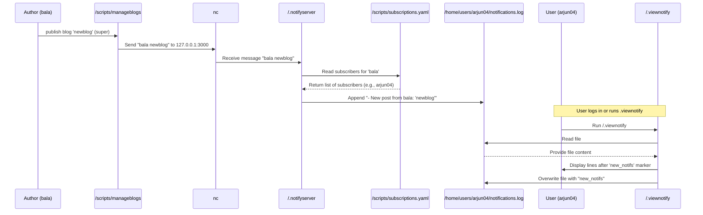

# Chapter 5: Notification System

Welcome back! In [Chapter 4: Subscription Mechanism](04_subscription_mechanism_.md), we learned how regular users (`g_user`) can subscribe to their favorite authors using the `suprise` script, and how this updates the `/scripts/subscriptions.yaml` file and creates handy shortcut links.

But what happens *after* you subscribe? How do you find out when that author you followed publishes exciting new content, especially the exclusive stuff just for subscribers? That's where the **Notification System** comes in!

Imagine you're subscribed to an author, and they just finished writing an amazing blog post only for their subscribers. You wouldn't want to keep checking their page every hour, right? The Notification System's job is to **automatically alert you** when this happens.

The main problem this system solves is: **How to reliably inform subscribed users when an author publishes new content specifically marked for subscribers.**

Here's the core idea:

1.  An Author publishes a new subscriber-only blog.
2.  This action triggers a tiny message being sent within the system.
3.  A background process receives this message.
4.  This process checks the subscription list (the `/scripts/subscriptions.yaml` file) to see who is subscribed to that author.
5.  For each subscriber, a simple notification is added to their personal "notification inbox" file.
6.  When the user next interacts with the system (like logging in), they see a list of their new alerts.

It's like getting a little internal memo saying, "Hey! Your favorite author just posted something new for you!"

Let's break down how this works in the Delta Blog system, looking at the components involved.

### The Trigger: Publishing a Subscriber-Only Blog

As we saw in [Chapter 3: Blog Content Management](03_blog_content_management_.md), Authors use the `/scripts/manageblogs` script. When an author wants to publish a blog **specifically for subscribers**, they use the `-super` option:

```bash
# Example: Author 'bala' publishes 'newblog' for subscribers
bash /scripts/manageblogs -super newblog
```

The `manageblogs` script does the usual things like updating the `blogs.yaml` file and creating the symbolic link in the author's `subscribers_only` directory. But there's one extra, crucial step for `-super`: **It sends a message to a special listener process.**

How does it send this message? Using a simple command-line tool called `netcat` (often just `nc`).

Look at the `super_publish` function inside the `manageblogs` script:

```bash
# From scripts/manageblogs (Simplified 'super_publish' function)

function super_publish() {
    # ... (updates blogs.yaml and creates symlink as described in Chapter 3) ...

    echo "Blog '$blogname' published to subscribers only."

    # Send notification (handled by the Notification System)
    echo "$author $blogname" | nc 127.0.0.1 3000 # Sends message to notification server
    echo "Notification sent to subscribers"
}
```

The key line is: `echo "$author $blogname" | nc 127.0.0.1 3000`.

*   `echo "$author $blogname"`: This creates a simple text message containing the author's username and the blog name (e.g., "bala newblog").
*   `|`: This is a pipe. It sends the output of the `echo` command as input to the next command.
*   `nc 127.0.0.1 3000`: This is the `netcat` command.
    *   `nc`: The netcat tool.
    *   `127.0.0.1`: This is the "localhost" address, meaning "this computer itself". The message is sent locally.
    *   `3000`: This is the port number. The message is sent to port 3000 on the local machine.

So, when an author publishes a subscriber-only blog, the `manageblogs` script immediately shouts a message like "bala newblog!" onto the local network on port 3000.

### The Listener: `.notifyserver`

Who is listening for messages on port 3000? That's the job of the background script `.notifyserver`. This script is started automatically when you run the main `sudo bash delta-setup` script, as mentioned in the `ReadMe.md`:

```bash
sudo bash delta-setup
# ... performs other setup ...
# Starts .notifyserver in background
nohup bash /scripts/.notifyserver > /dev/null 2>&1 &
```

The `nohup ... &` part means the script runs in the background even after you close your terminal.

The `.notifyserver` script is essentially a simple server using `netcat`. It listens on port 3000 (or potentially a range of ports) and waits for messages like "author blogname". When it receives one, it processes it.

Here's a simplified idea of what `.notifyserver` does:

```bash
#!/bin/bash

SUBSCRIPTIONS_FILE="/scripts/subscriptions.yaml"
NOTIFICATIONS_DIR="/home/users/" # Where user notification files are

# ... (setup like finding an available port) ...

# Start listening with netcat in a loop
while true; do
    echo "Starting ncNotify server on ports 3000-3999" # Simplified: actual script might use specific port
    # Listen for one line of input on port 3000 (or chosen port)
    received_message=$(nc -l -k 3000) # -l: listen, -k: keep listening after connection

    echo "Received message: $received_message"

    # Expecting message format: "author blogname"
    author=$(echo "$received_message" | awk '{print $1}')
    blogname=$(echo "$received_message" | awk '{print $2}')

    echo "Notification broadcasted: $author/$blogname"

    # Find subscribers for this author from subscriptions.yaml
    # This uses yq to read the list of users under the author's key
    subscribers=$(yq e ".\"$author\"[]" "$SUBSCRIPTIONS_FILE" 2>/dev/null)

    # Loop through each subscriber
    for user in $subscribers; do
        notif_file="$NOTIFICATIONS_DIR/$user/notifications.log"
        # Append the new notification to the user's log file
        echo "- New post from $author: '$blogname'" >> "$notif_file"
        echo "  > Notified user: $user"
    done

done # Keep listening
```

Let's break this down:

*   `nc -l -k 3000`: This command makes `netcat` listen (`-l`) on port 3000 and keep listening (`-k`) after receiving a message. It waits here until something connects and sends data.
*   `received_message=$(...)`: When data arrives, `netcat` outputs it, and this output is captured into the `received_message` variable.
*   `author=$(echo "$received_message" | awk '{print $1}')` and `blogname=$(echo "$received_message" | awk '{print $2}')`: Simple use of `awk` to split the message "author blogname" into the author's name and the blog's name.
*   `subscribers=$(yq e ".\"$author\"[]" "$SUBSCRIPTIONS_FILE" 2>/dev/null)`: This is where `yq` is used to read the `subscriptions.yaml` file. It looks up the author's name and extracts the list (`[]`) of users subscribed to them.
*   `for user in $subscribers; do ... done`: The script then loops through the list of subscribed usernames obtained from `yq`.
*   `notif_file="$NOTIFICATIONS_DIR/$user/notifications.log"`: Constructs the path to the specific user's notification file within their home directory.
*   `echo "- New post from $author: '$blogname'" >> "$notif_file"`: This is the core action. It takes the notification message and appends (`>>`) it to the end of the user's `notifications.log` file.

So, `.notifyserver` acts as the central hub. It waits for publication alerts and then distributes the notification message to the correct users based on the subscription data.

### The Notification File: `notifications.log`

Every regular user (`g_user`) and Author (`g_author`) who is also a user has a file in their home directory: `/home/users/username/notifications.log` (or `/home/authors/username/notifications.log` if they are an author who can also subscribe as a user).

This file is simply a list of notification messages received. For example, `arjun04`'s file might look like this after receiving a notification from `bala`:

```
# File: /home/users/arjun04/notifications.log
- New post from bala: 'newblog'
```

The `.notifyserver` script is responsible for *writing* to this file.

There's a special marker line, `new_notifs`, used within this file to help the *viewer* script know which notifications are new. Let's look at the structure as the viewing script expects it:

```
# File: /home/users/arjun04/notifications.log
- Old read notification 1
- Old read notification 2
new_notifs # <--- This line separates read notifications from new ones
- New post from bala: 'newblog' # <--- Added by .notifyserver
- Another new post from authorX: 'titleY' # <--- Added by .notifyserver
```

### Viewing Notifications: `.viewnotify`

How does a user actually see these messages? The Delta Blog system includes a script specifically for this: `/scripts/.viewnotify`.

This script is executed when a user logs in (it's likely added to their shell profile, though not explicitly shown in the provided snippets, this is a common way to trigger scripts on login). A user can also run it manually:

```bash
# Assuming you are logged in as arjun04
bash /scripts/.viewnotify
```

The `.viewnotify` script reads the user's `notifications.log` file, finds the new messages, displays them, and then updates the file to mark those messages as "read".

Let's look at a simplified version of `/scripts/.viewnotify`:

```bash
#!/bin/bash

notifs_file="$HOME/notifications.log"

if [[ ! -f "$notifs_file" ]]; then
    echo "No notifications yet."
    exit 0
fi

echo "Your Notifications:"
# Use awk to print lines *after* the 'new_notifs' marker
awk '
    BEGIN { seen=0 } # Start with seen=0
    /^new_notifs$/ { seen=1; next } # If we see 'new_notifs', set seen=1 and skip this line
    seen { print } # If seen is 1, print the line
' "$notifs_file"

# Mark all as read: Overwrite the file, putting 'new_notifs' at the top
echo "new_notifs" > "$notifs_file" # Using > overwrites the file

echo "" # Add a blank line for readability
```

Explanation:

*   `notifs_file="$HOME/notifications.log"`: Gets the path to the user's specific notification file using the `$HOME` environment variable.
*   `awk '...' "$notifs_file"`: Uses the `awk` command to process the file line by line.
    *   `BEGIN { seen=0 }`: Before processing any lines, set a variable `seen` to 0.
    *   `/^new_notifs$/ { seen=1; next }`: If a line exactly matches `new_notifs`, set `seen` to 1 and skip to the next line (`next`).
    *   `seen { print }`: If the `seen` variable is 1 (meaning we are after the `new_notifs` line), print the current line.
*   `echo "new_notifs" > "$notifs_file"`: This is clever. It *overwrites* the entire `notifications.log` file with just the line `new_notifs`. This effectively clears the list of "new" notifications, preparing the file for the next incoming notifications to be appended *after* this line.

So, `.viewnotify` finds the messages marked as new by the `new_notifs` line and resets the file to mark them as read.

### Checking Notification Count: `.notifycorn`

Besides viewing notifications on login, the system also includes a script `.notifycorn` that runs periodically via cron. Its purpose is likely to provide a *count* of new notifications without displaying the full list every time.

The `ReadMe.md` mentions it:

```markdown
| Script        | Purpose                                                            |
| ------------- | ------------------------------------------------------------------ |
| .notifycorn   | Periodically checks and shows new notification count               |
```

And it's added to the user's crontab during setup (this part isn't shown in snippets but implied):

```cron
*/1 * * * * /scripts/.notifycorn # Example: run every minute
```

The `.notifycorn` script would likely read the user's `notifications.log` and count the lines *after* the `new_notifs` marker, similar to how `.viewnotify` uses `awk`, but just outputting a count like "You have 2 new notifications."

### The Complete Notification Flow

Let's put it all together in a diagram:



This flow shows how a single action by an author triggers a chain reaction involving several scripts and files, resulting in a personalized notification delivered to the relevant users.

### Initial Setup (`.notifysetup`)

Finally, how does each user get their own `notifications.log` file and the `.viewnotify` script in their home directory (or linked there)? This is handled during the initial system setup by the `.notifysetup` script, which is called by `delta-setup`:

```markdown
| Script       | Purpose                                        |
| ------------ | ---------------------------------------------- |
| .notifysetup | Installs `.viewnotify` in user home directories |
```

This script would likely iterate through the list of users (from `users.yaml`), create an empty `notifications.log` file in each user's home directory (starting with the `new_notifs` marker), and potentially copy or link the `.viewnotify` script into their home directory or a place accessible to them.

### In Summary

The Notification System in Delta Blog uses a simple yet effective approach to alert users about new subscriber-only content:

*   When an Author publishes a subscriber-only blog (`manageblogs -super`), a message is sent locally using `netcat`.
*   A background script (`.notifyserver`) constantly listens for these messages.
*   The server looks up the author's subscribers in the `/scripts/subscriptions.yaml` file.
*   It then appends a notification message to each subscriber's personal `notifications.log` file in their home directory.
*   The `/scripts/.viewnotify` script (run on login or manually) reads this file, displays new messages (found after the `new_notifs` marker), and resets the file to mark them as read.
*   The `.notifycorn` script provides a periodic count of new notifications.
*   All these components and initial files are set up automatically by `.notifysetup` during the main `delta-setup`.

This system ensures that users who have subscribed using the mechanism from [Chapter 4](04_subscription_mechanism_.md) are promptly informed when new content becomes available just for them.

Now that we understand how users are notified, let's look at how a regular user can take the next step and become an Author themselves.

[Next Chapter: Author Promotion Workflow](06_author_promotion_workflow_.md)

---

<sub><sup>Generated by [AI Codebase Knowledge Builder](https://github.com/The-Pocket/Tutorial-Codebase-Knowledge).</sup></sub> <sub><sup>**References**: [[1]](https://github.com/JACKURUVI99/Delta-Blog-Setup/blob/2ca0ab6329198dc437d264c5b624e7ba1f90f76a/ReadMe.md), [[2]](https://github.com/JACKURUVI99/Delta-Blog-Setup/blob/2ca0ab6329198dc437d264c5b624e7ba1f90f76a/scripts/ReadMe.md), [[3]](https://github.com/JACKURUVI99/Delta-Blog-Setup/blob/2ca0ab6329198dc437d264c5b624e7ba1f90f76a/scripts/manageblogs), [[4]](https://github.com/JACKURUVI99/Delta-Blog-Setup/blob/2ca0ab6329198dc437d264c5b624e7ba1f90f76a/scripts/nohup.out), [[5]](https://github.com/JACKURUVI99/Delta-Blog-Setup/blob/2ca0ab6329198dc437d264c5b624e7ba1f90f76a/scripts/subscriptions.yaml), [[6]](https://github.com/JACKURUVI99/Delta-Blog-Setup/blob/2ca0ab6329198dc437d264c5b624e7ba1f90f76a/scripts/view_notifs)</sup></sub>