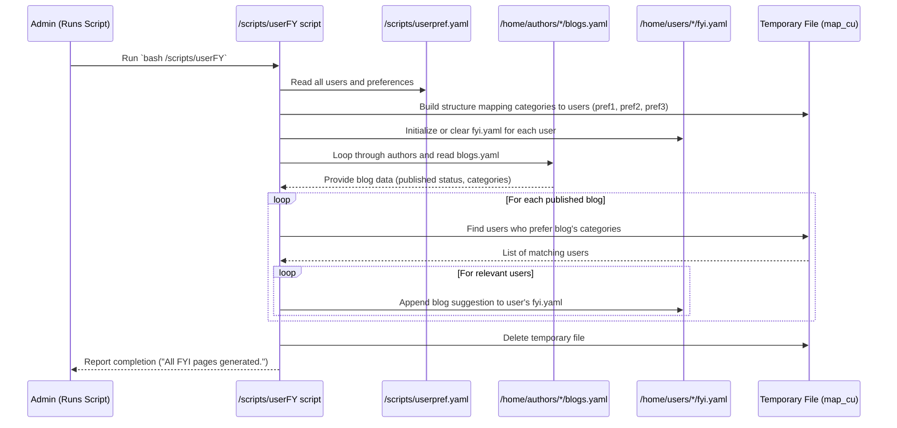

# Chapter 7: User Preferences and FYI

Welcome back! We've covered a lot of ground, from understanding different users and their powers ([Chapter 1: User Roles and Management](01_user_roles_and_management_.md)) and how those powers are enforced through permissions ([Chapter 2: Permissions and Access Control (ACLs)](02_permissions_and_access_control__acls__.md)), to authors managing their content ([Chapter 3: Blog Content Management](03_blog_content_management_.md)), users subscribing to authors ([Chapter 4: Subscription Mechanism](04_subscription_mechanism_.md)), and getting notified about new content ([Chapter 5: Notification System](05_notification_system_.md)), and even how a regular user can become an author ([Chapter 6: Author Promotion Workflow](06_author_promotion_workflow_.md)).

Now, let's explore a feature that tries to personalize the experience: **User Preferences and FYI (For Your Information)**.

Imagine our blog platform has tons of articles across many topics. As a user, you might be interested in Technology and Travel, but not so much in Finance or Sports. It would be great if the system could somehow figure out what you like and show you blog posts related to *your* interests, rather than making you dig through everything.

This is exactly what the "User Preferences and FYI" feature is designed to do! Its goal is to **provide users with personalized recommendations or information ("FYI") based on their declared interests.**

Think of it as a simple recommendation engine:

1.  Users tell the system (or have it configured for them) what topics they like.
2.  An administrator runs a special process.
3.  This process looks at all the published blogs and their categories.
4.  It matches blog categories with user interests.
5.  It generates a personalized list of suggested blogs for each user.

This chapter will show you where user preferences are stored and how an administrator uses a script to generate these "For Your Information" recommendations.

### Where Are User Preferences Stored?

The system keeps track of user preferences in a dedicated file: `/scripts/userpref.yaml`.

This file is a simple YAML list of users, and for each user, it records their preferred categories. It seems designed to hold a fixed number of preferences per user (pref1, pref2, pref3).

Let's look at a simplified example of `/scripts/userpref.yaml`:

```yaml
# File: /scripts/userpref.yaml (Simplified Snippet)
users:
  - name: Aarav
    username: aarav01
    pref1: Technology
    pref2: Finance
    pref3: Sports

  - name: Aisha
    username: aisha02
    pref1: Cinema
    pref2: Lifestyle
    pref3: Travel

  # ... many more users ...
```

This file lists users by their full name and username, and then explicitly states their top 3 interests using `pref1`, `pref2`, and `pref3`. The values (like `Technology`, `Finance`, `Sports`) are expected to match the blog categories authors can use (which are defined in each author's `blogs.yaml` file, as seen in [Chapter 3](03_blog_content_management_.md)).

**Important Note:** The system setup implies that this `userpref.yaml` file is created and populated during the initial `delta-setup`. There isn't a user-facing script for users to *change* their preferences after setup in the provided code snippets. It's likely assumed that preferences are set initially by an administrator or a separate configuration step.

### The `userFY` Script: Generating FYI

The magic that turns these stored preferences into actual recommendations is performed by the `/scripts/userFY` script.

According to the [Usage Guide in /scripts/ReadMe.md](scripts/ReadMe.md), this script is intended for **Admins**:

```markdown
| Script           | Role      | Description                             | Usage Example                                     |
| ---------------- | --------- | --------------------------------------- | ------------------------------------------------- |
| userFY           | Admin     | View blog and user statistics           | `bash /scripts/userFY username`                   |
```

Wait, the description says "View blog and user statistics", but the concept details and code snippet show it's about preferences and recommendations. This might be a slight mismatch in the `ReadMe`, or the script *could* have other reporting functions not fully shown. Based on the provided code, its primary *output* is generating user-specific FYI recommendations. The usage example `bash /scripts/userFY username` is also misleading based on the code, which processes *all* users defined in `userpref.yaml` without needing a specific username argument. It's likely intended to be run simply as `bash /scripts/userFY`.

So, the main use case is: **An administrator runs `userFY` periodically to generate updated recommendations for all users.**

Let's look at the start of the `userFY` script to confirm it's for admins and where it gets user data:

```bash
# From scripts/userFY (Simplified)

USERS_PREF_FILE="/scripts/userpref.yaml"
admin_user="${SUDO_USER:-$USER}"

# Check if the user running this script is an admin
if ! groups "$admin_user" | grep -qw "g_admin"; then
    echo "Only admins can run this script."
    exit 1
fi

# Find all author directories to read their blogs.yaml
authors_base=($(ls -1d /home/authors/*/))

# ... rest of the script ...
```

This confirms:
1.  It reads the `/scripts/userpref.yaml` file (`USERS_PREF_FILE`).
2.  It strictly enforces that only users in the `g_admin` group can run it, checking the `$SUDO_USER` or `$USER` environment variable. This links back to [Chapter 1: User Roles and Management](01_user_roles_and_management_.md).
3.  It finds all author directories (`/home/authors/*/`) because it needs to read *all* author `blogs.yaml` files to see the available published content and their categories ([Chapter 3: Blog Content Management](03_blog_content_management_.md)).

### How `userFY` Generates Recommendations (Simplified Workflow)

Here's a high-level overview of what the `userFY` script does when run by an admin:

1.  **Read Preferences:** It reads `/scripts/userpref.yaml` to get the list of all users and their preferred categories.
2.  **Organize Users by Preference:** It builds a temporary structure (using a temporary file and `yq`) that lists which users prefer which category at which preference level (pref1, pref2, pref3). This makes it easier to find users interested in a specific blog category later.
3.  **Prepare Output Files:** For each user found in `userpref.yaml`, it creates or clears their personal FYI file, `/home/users/username/fyi.yaml`.
4.  **Process Blogs:** It goes through every author's `blogs.yaml` file.
5.  **Filter Published Blogs:** For each author, it reads their blogs and only considers those marked as `publish_status: true`.
6.  **Match and Recommend:** For each published blog, it looks at its categories (`cat_order` in `blogs.yaml`). It then checks the temporary structure built in step 2 to find users who listed one of these categories as their pref1, pref2, or pref3.
7.  **Distribute Recommendations:** For users found in step 6, the script adds the blog information (file name, category, author) as a "suggestion" entry to their specific `/home/users/username/fyi.yaml` file. It does this in a way that tries to give priority to pref1 matches and also aims to distribute recommendations somewhat evenly.
8.  **Clean Up:** Removes the temporary file used for organizing users by preference.

Let's visualize this core process:



This diagram shows how the script pulls data from the central `userpref.yaml` and the decentralized author `blogs.yaml` files, processes it, and writes the personalized output to each user's own `fyi.yaml` file.

### The Output: `fyi.yaml`

After the `userFY` script runs, each user listed in `userpref.yaml` will have a file in their home directory, for example, `/home/users/aarav01/fyi.yaml`. This file contains the blog recommendations generated specifically for them.

Here's what `/home/users/aarav01/fyi.yaml` might look like after `userFY` runs, based on Aarav's preferences (Technology, Finance, Sports):

```yaml
# File: /home/users/aarav01/fyi.yaml (Example Content)
suggestions:
  - file_name: "latest-tech-trends.txt"
    category: "Technology"
    author: "ananya"
  - file_name: "investing-basics.txt"
    category: "Finance"
    author: "bala"
  - file_name: "world-cup-recap.txt"
    category: "Sports"
    author: "chandra"
  - file_name: "another-tech-article.txt"
    category: "Technology"
    author: "david"
  # ... more suggestions ...
```

The file is a YAML structure with a single key, `suggestions`, which is a list. Each item in the list is an object containing the `file_name` of the recommended blog, its `category`, and the `author`.

**How does a user see this?** The system doesn't provide a dedicated user script (like `.viewfyi`) in the snippets to display this nicely. A user would likely need to view this file directly using commands like `cat` or `yq`.

```bash
# Assuming logged in as aarav01
cat /home/users/aarav01/fyi.yaml
# Or, using yq to just list the blog file names and authors:
yq e '.suggestions[] | .author + "/" + .file_name' /home/users/aarav01/fyi.yaml
```

This suggests the recommendations are there for users to find, but the interface for viewing them is minimal in this project version.

### Diving into the `userFY` Script Logic

Let's break down a few more pieces of the `/scripts/userFY` script to understand the recommendation logic, keeping it simple and focusing on the *what* rather than the *how* of the complex shell scripting.

After reading user preferences and authors' `blogs.yaml`, the script has information about:
*   Users and their top 3 preferred categories.
*   Published blogs, their file names, authors, and category lists.

The script then essentially tries to match blogs to users. The core matching loop looks something like this (simplified):

```bash
# From scripts/userFY (Simplified loop structure)

# Calculate how many recommendations per blog to aim for (approx users / blogs)
n_blogs=$(find /home/authors/*/public/ -type f | wc -l)
n_users=$(yq '.users | length' "$USERS_PREF_FILE")
n=$((n_users / n_blogs)) # Simple ratio

# ... (Outer loop iterates through each author_base directory) ...
# ... (Inner loop iterates through each blog in the author's blogs.yaml) ...

    # Skip if the blog is not published
    if [[ "$publish_status" == "false" ]]; then continue; fi

    # Get the blog's categories (e.g., [3, 6] for Technology, Lifestyle)
    cat_order=($(echo "$blog" | yq -r '.cat_order[]'))

    # This inner part tries to match the blog to users
    _n=0 # Counter for how many times this blog has been recommended
    curr_cat_idx=0 # Index for the blog's categories (starts with the first category)
    pref_no=1 # Preference level (starts with pref1)

    # Loop while we haven't recommended this blog 'n' times yet
    while [ $_n -lt $n ]; do
        # Get the current category number from the blog's category list
        cate_no=${cat_order[curr_cat_idx]:-}
        if [[ -z "$cate_no" ]]; then break; fi # Stop if no more categories for this blog

        # Look up the *name* of the category from the author's blogs.yaml
        category=$(yq -r ".categories[$((cate_no - 1))]" "$blogs_data_file")

        # Use yq to find a user who has '$category' as their preference number '$pref_no'
        # It finds the first user in the temporary map_cu who matches this criteria
        user=$(yq -r ".$category.$pref_no[0] // \"\"" "$map_cu")

        if [[ -z "$user" ]]; then
            # No user found who wants this category at this preference level
            # Try the next preference level (pref2, then pref3)
            if [[ $pref_no -eq 3 ]]; then
                # If we've tried pref1, pref2, pref3 for this category, move to the next category of the blog
                ((curr_cat_idx++))
                pref_no=1 # Reset preference level to 1 for the new category
            else
                # Otherwise, just increment the preference level for the current category
                ((pref_no++))
            fi
            continue # Try finding a user again in the next iteration
        fi

        # --- Found a user! ---

        # Remove the user from the temporary map_cu for this category/pref slot
        # This prevents recommending the same blog to the same user multiple times via different prefs
        # and helps distribute recommendations
        yq -i "del(.$category.$pref_no[0])" "$map_cu"

        # Format the blog information as a suggestion object
        suggestion=$(cat <<EOF
{
  "file_name": "$file_name",
  "category": "$category",
  "author": "$author"
}
EOF
)
        # Define the user's fyi.yaml file path
        fyi="/home/users/$user/fyi.yaml"
        # Append the suggestion object to the user's fyi.yaml suggestions list
        yq -i ".suggestions += [$suggestion]" "$fyi"

        # Increment the counter for how many times this blog has been recommended
        ((_n++))
        # Move to the next preference level to find another user for this category
        # (or move to the next category if pref_no becomes 4)
        if [[ $pref_no -eq 3 ]]; then
            ((curr_cat_idx++))
            pref_no=1
        else
            ((pref_no++))
        fi

    done # End of while loop matching users for this blog
done # End of blog loop
```

This part of the script is a bit intricate, but the core idea is to iterate through the blog's categories and the user preference levels (pref1, pref2, pref3), trying to find users who match those preferences. When a match is found, the blog is added to that user's `fyi.yaml`, and that specific user/preference slot is 'used up' for this blog to help spread out recommendations. The `n` variable tries to limit how many times any single blog is recommended across all users.

This system provides a basic, rule-based approach to generating recommendations based on explicit category preferences.

### In Summary

The "User Preferences and FYI" feature allows the Delta Blog system to generate personalized blog recommendations for users.

*   User preferences (top 3 categories) are stored in the `/scripts/userpref.yaml` file, typically configured during setup.
*   The `/scripts/userFY` script, run by an administrator, processes these preferences.
*   `userFY` reads all published blogs and their categories (from author `blogs.yaml` files).
*   It matches user preferences to blog categories and generates a list of suggested blogs for each user.
*   These suggestions are written to each user's personal `/home/users/username/fyi.yaml` file.
*   Users can view their recommendations by checking their `fyi.yaml` file.

This feature provides a simple way to highlight relevant content to users, adding a layer of personalization to the blog platform.

Now that we've explored how content is recommended, let's move on to the important task of keeping the platform clean and appropriate: Content Moderation.

[Next Chapter: Content Moderation](08_content_moderation_.md)

---

<sub><sup>Generated by [AI Codebase Knowledge Builder](https://github.com/The-Pocket/Tutorial-Codebase-Knowledge).</sup></sub> <sub><sup>**References**: [[1]](https://github.com/JACKURUVI99/Delta-Blog-Setup/blob/2ca0ab6329198dc437d264c5b624e7ba1f90f76a/scripts/userFY), [[2]](https://github.com/JACKURUVI99/Delta-Blog-Setup/blob/2ca0ab6329198dc437d264c5b624e7ba1f90f76a/scripts/userpref.yaml)</sup></sub>